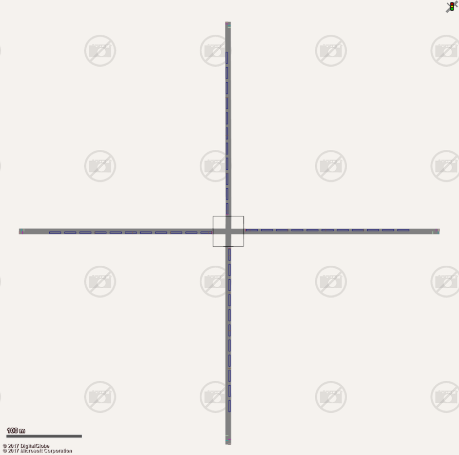
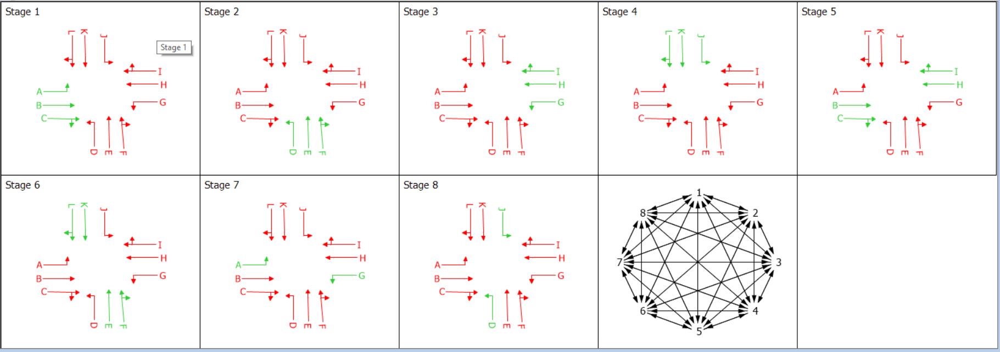
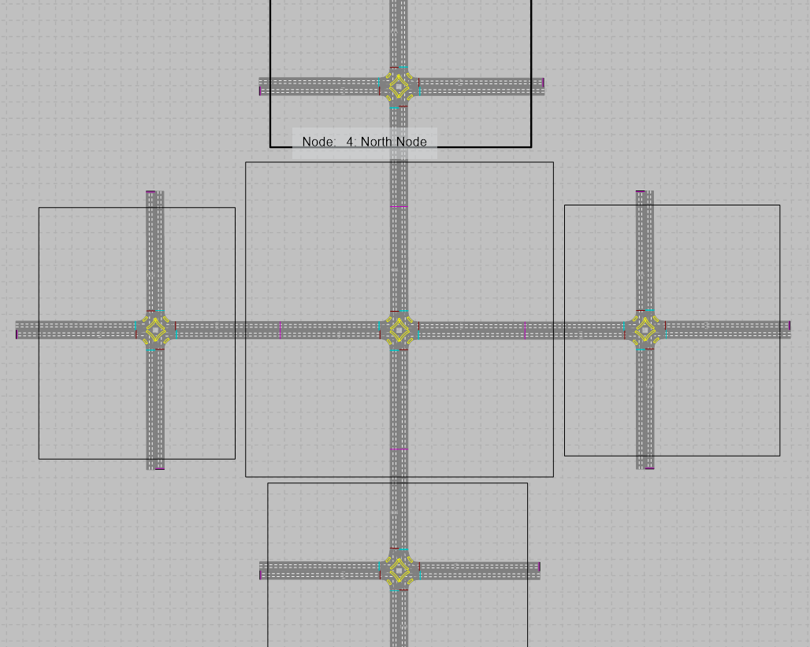
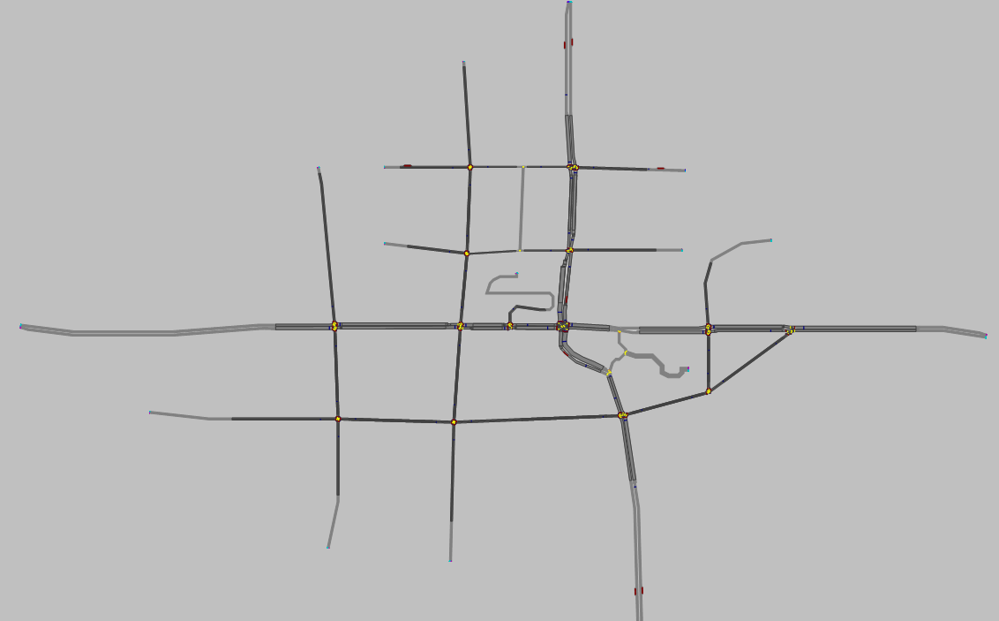
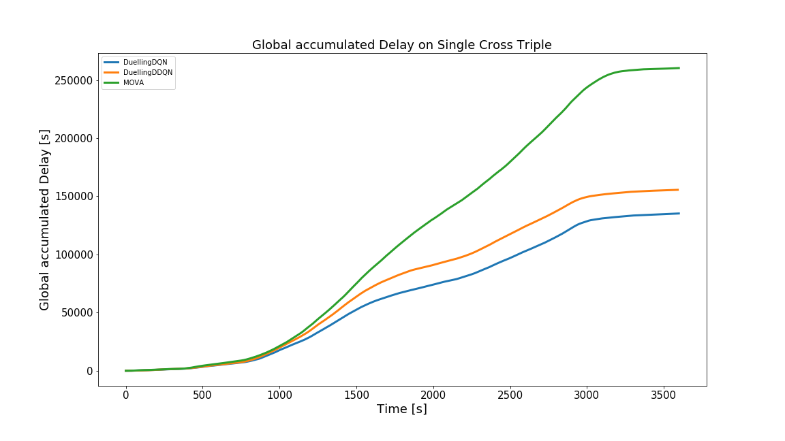
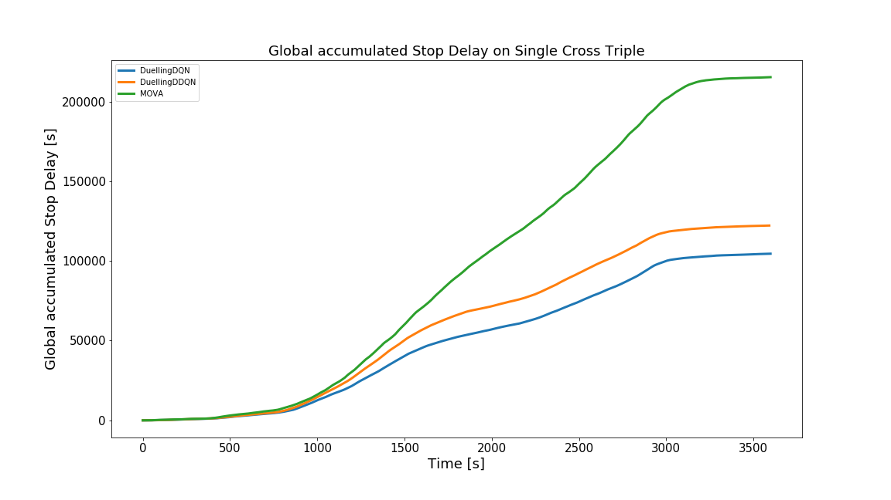

# MLforFlowOptimisation

## How to run
Open Jupyter Notebook. Currently in the middle of some major code rearrangement, so everything needs to be run from Env_Ray.ipynb.
The controller architecture works in the following way:
 

There are currently 3 maps:
 - Cross Single Straight (2 phases) - Focus on asymmetric demand. Can be run using programs or phases. No turning.
 

 - Cross Single Triple (4 phases) - Focus on single intersection complex control. Only the first 4 phases in the diagram below.
 - Cross Single Triple (8 phases) - Same with more complexity on the actions side.
 
 
 
 - Five Intersection (8 phases) - Combination of 5 complex intersections in cross, s.t. the incoming cars to the middle intersection have at least gone through one of the outer ones.
 
 
 - Balance (14 intersections) - Currently training.
  

 Several agents can be deployed:
 - DQN
 - Double DQN
 - Duelling DQN
 - Duelling Double DQN
 - Actor Critic
 
 Commercial approaches can be used:
 - MOVA
 - Surtrac

## Results
Currently under construction

### Single Cross Straight
 
 
Single_straight_cross.PNG)

### Cross Single Triple
 
 

### Five Intersection
 
 

